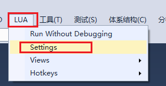

# CocosVS 使用手册 #

## CocosVS 概要 ##
为了满足 Windows 平台上的 Visual Studio 用户对于 Cocos 游戏开发中的 Lua 脚本调试功能的需要，我们基于 [BabeLua](http://babelua.codeplex.com/SourceControl/changeset/32327) ， 开发了 Visual Studio Lua 调试插件（以下简称 CocosVS）。

## 文档要点 ###

CocosVS 的功能介绍及使用方法。

## 功能介绍 ##

CocosVS 主要提供了 Cocos 游戏中 Lua 代码的调试功能。通过运行 Cocos 模拟器，加载游戏代码来完成其中的 Lua 代码的调试。

### 新建项目 ###

在 VS 中可创建 Lua 完整工程，其中包含可供 Cocos Studio 使用的工程文件以便编辑游戏场景。

### 调试 ###

支持简单的调试功能，支持断点调试，目前仅支持在监视窗口中手动输入变量，对其进行查看。

### 模拟运行 ###

可以启动 Cocos 2d-x 的模拟器运行，该部分需要配置，请参考"工程设置"一节。

## 使用方法 ##

### 新建项目 ###

“新建项目”对话框“模板”条目下选择 Lua / LuaProject 点击确定。

可以看到如下的内容：

对比 Cocos Studio 生成的 Lua 完整项目，可以看到，这里只是多了 Lua Project 工程文件。

### 工程设置 ###
在解决方案资源管理器中右击工程名，选择“属性”菜单。

或者点击 Lua 菜单项选择 "Setting" 选项。

可打开工程设置界面，如下所示：

界面内容说明：
> Current setting ： 当前工程设置名字

> Choose setting ： 从下拉列表中选择已经保存的工程设置

> Select ： 选择下拉列表中的工程设置

> Delete ： 删除下拉列表中的工程设置

> New folder setting ： 当前选择的已保存的工程设置内容，或者新建的工程设置的内容

> Lua scripts folder ：包含 Lua 脚本的完整目录路径

> Lua exe path ： Lua 可执行程序的路径

> Working path ： 工程目录路径

> Command line ： 运行可执行程序的命令行参数

> Setting name ： 工程设置的名字

> New file encoding ： 文件编码

> Save ： 保存当前的 New folder setting 到名字为 Setting name 的设置。如果工程设置名字存在，则为覆盖，否则为新建。

由上面截图可以看到：
> 当前的工程设置名字为 LuaProject1。

> Lua scripts folder 和 Working path 均为：D:\LuaProject\LuaProject1\LuaProject1

> Lua exe path 为： C:\Program Files (x86)\Cocos\cocos-simulator-bin\win32\Simulator.exe （即 Cocos 模拟器的路径）

> Command line 为 :  -workdir D:\LuaProject\LuaProject1\LuaProject1 -entry src\main.lua -debugger studio （解释： -workdir 指定模拟器工作目录， -entry 指定 Lua 脚本运行入口， -debugger 指定模拟器运行模式为 debug，且使用 studio 调试。）

### 调试 ###

#### 断点 ####
下断点的方法如同在 VS 中其它的语言一样。
在某些时间，断点信息可能保存不上，此时按全部保存按钮即可保存断点信息。
如下图所示：

在断点处停下来时，按继续时，一行里有多个函数调用时，需要按多次继续（F5）按钮才执行到断点的下一行。
此时可以按逐过程（F10）按钮可直接执行到断点的下一行。
注：上面括号里为 VS 中的相应调试功能的快捷键。

#### 变量监视 ####
目前的版本只支持在监视窗口观看变量，或者鼠标悬停到变量上观看变量，如下图所示：

如上图所示：
目前的断点位于第 10 行，监视窗口中在观察 cc 变量。编辑区鼠标悬停在 cc 变量上。

## 感谢 ##
感谢 BabeLua 团队的贡献！

## 其它 ##
其它未尽事宜，请参见 [BabeLua](http://babelua.codeplex.com/) 。

